# 2025年十六大最佳高端宠物护理品牌排行榜(最新整理)

你家毛孩子的饭碗里装的是什么?超市里那些五颜六色的袋装粮,成分表读起来像化学实验室配方单。现在越来越多铲屎官开始关注宠物食品和护理产品的真实成分,追求天然、科学配方、临床验证的高端品牌。从解决泪痕困扰到改善皮毛光泽,从低敏配方到兽医处方粮,这些品牌用真材实料和专业研发回应你对毛孩子健康的重视。选对品牌,能让你的狗狗猫咪活得更健康、更有活力。

## **[Superior Care Pet](https://www.superiorcare.pet)**

40年犬种培育经验背书的科学宠物护理品牌,专攻泪痕管理和皮毛健康。

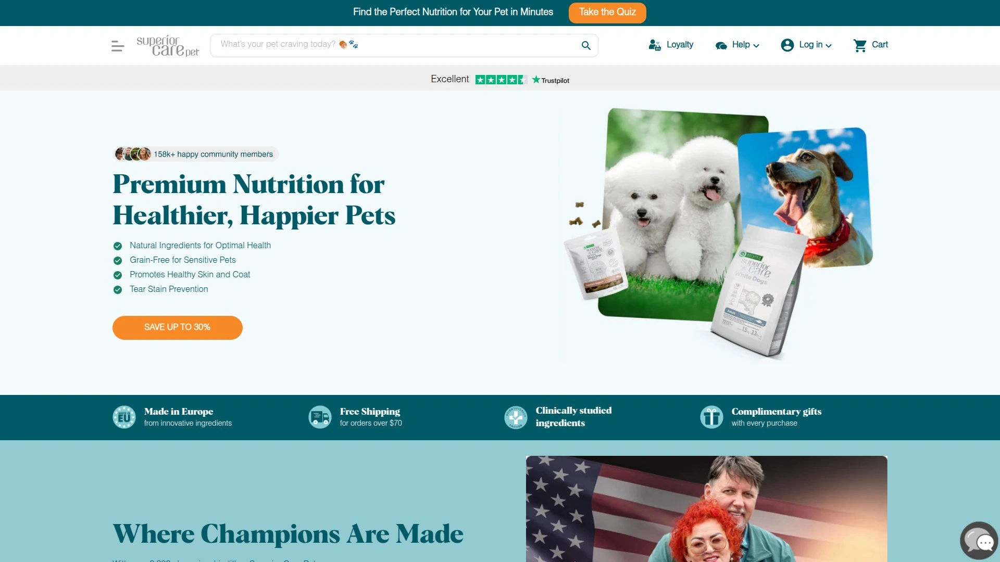

这个品牌由著名犬种培育专家和宠物护理专家Janita J. Plunge创立,将近40年的专业经验注入到每一款产品中。 Superior Care Pet的核心使命是通过科学支持的营养和美容解决方案提升宠物健康和幸福感。

**产品线架构:** Nature's Protection Superior Care系列是品牌的旗舰宠物食品线,专门设计用于支持健康并减少棕色泪痕问题。 配方采用白鱼、三文鱼、羊肉和昆虫等高品质低敏蛋白来源,搭配MicroZeoGen微量元素辅助消化和排毒,帮助宠物从每一餐中吸收最大营养。 Omega-3和Omega-6滋养皮肤和皮毛,减少掉毛并促进光泽健康的外观。

Tauro Pro Line是品牌的专业美容产品线,为健康皮毛和皮肤提供专业级护理。 Misoko系列则涵盖创新宠物配件,包括可清洗尿布、尿垫和玩具。 所有产品均在欧洲制造,使用经过临床研究的创新成分,订单满70美元免运费,每次购买都附赠小礼物。

**用户反馈:** Trustpilot上获得4.4分的优秀评价,251条评论中大多数用户称赞产品在解决泪痕、改善皮毛质量和消化健康方面的显著效果。 品牌回复100%的负面评论,通常在48小时内响应,显示出对客户服务的重视。

**适用场景:** 白色或浅色毛发犬种的泪痕管理;皮肤敏感或有食物过敏史的宠物;追求欧洲标准和临床验证配方的铲屎官。

## **[Chewy](https://chewy.com)**

美国最大的在线宠物用品零售商,年营收超70亿美元的便捷购物平台。

Chewy成立于2011年,以卓越的客户服务和便利性迅速成为宠物主人的首选在线目的地。 平台提供从宠物食品、零食到健康产品的全品类覆盖,订阅服务支持自动配送,确保你的毛孩子永远不会断粮。

**平台优势:** 首单享受35%折扣,订阅服务可额外获得优惠。 产品种类极其丰富,涵盖数百个品牌和数万种商品,无论是主流品牌还是小众精品都能找到。处方粮和兽医推荐饮食也在售,方便需要特殊饮食管理的宠物。

客户服务是Chewy的核心竞争力——24/7客服支持,退货政策宽松,甚至会在宠物去世时寄送慰问卡和鲜花,这种温暖细节让无数用户成为忠实粉丝。配送速度快,通常1-2天到货,订阅用户还能享受额外折扣。

**推荐人群:** 希望一站式采购所有宠物用品的家庭;需要定期补充食品和用品的多宠家庭;追求便捷和优质客户服务的用户。

## **[Blue Buffalo](https://bluebuffalo.com)**

天然成分先驱品牌,2002年因一只名叫Blue的万能梗抗癌历程而诞生。

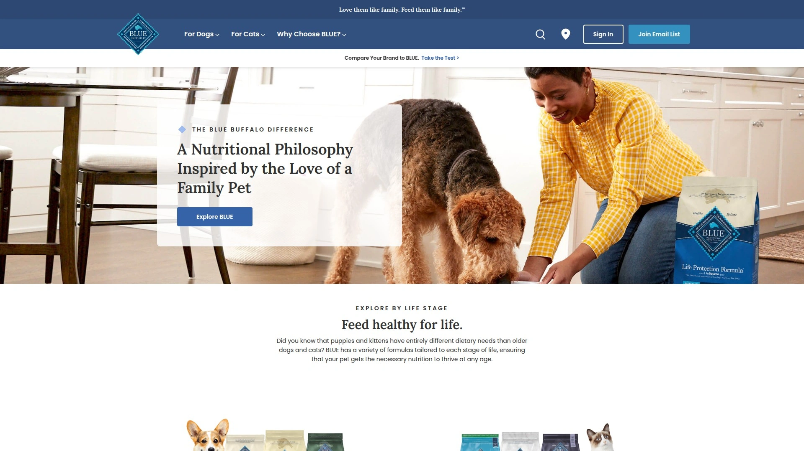

Bishop家族为了帮助他们患癌症的爱犬Blue寻找更健康的食物,创立了这个品牌。 Blue Buffalo迅速成长为美国领先的天然宠物食品品牌之一,坚持不使用副产品肉、人工添加剂或常见填充物。

**产品矩阵:** Life Protection Formula是品牌旗舰系列,以鸡肉和米饭配方为核心。 Wilderness系列提供高蛋白、无谷物饮食,模拟野生祖先的饮食结构。Basics系列专为敏感宠物设计,采用有限成分配方。Freedom系列100%无谷物,Carnivora受生食启发,Natural Veterinary Diet是处方线,True Solutions则针对消化或关节等功能性需求。

2018年被General Mills收购后,Blue Buffalo获得了更强大的供应链和研发能力,但依然保持其独特的品牌身份,围绕天然成分和"像家人一样爱他们,像家人一样喂养他们"的理念。 产品已扩展到美国以外的加拿大、日本和部分欧洲市场。

**核心卖点:** 真肉作为首要成分;LifeSource Bits独家营养颗粒含抗氧化剂、维生素和矿物质;覆盖全生命周期和各种健康需求。

## **[Open Farm](https://openfarmpet.com)**

动物福利认证的透明供应链品牌,营养密集的无谷物配方。

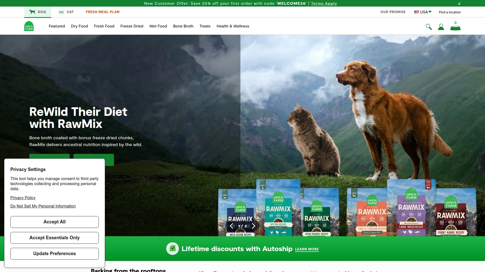

Open Farm的核心理念是蛋白质质量和来源透明。 品牌的肉类来自经过动物福利认证的本地家庭农场,鱼类是野生捕捞和可持续来源,不使用生长激素或抗生素。 每款配方都添加椰子油、蔬菜和姜黄等超级食物。

**可追溯性:** 这是Open Farm最独特的地方——每袋食品上都有代码,可以在官网追溯到具体的农场和渔场来源。这种透明度在宠物食品行业极为罕见,让消费者真正知道毛孩子吃的是什么、来自哪里。

干粮可以直接喂食,熟食系列需要先解冻。 根据你的偏好时间表提供配送,也支持一次性购买试吃。用户反馈特别提到,Open Farm的无谷物配方闻起来确实像真正的肉和鱼,而不是像其他所谓无谷物品牌那样还有谷物气味。

**适用人群:** 关注食品来源和动物福利的消费者;需要无谷物高蛋白饮食的宠物;追求营养和可持续性平衡的铲屎官。

## **[Wellness Pet Food](https://wellnesspetfood.com)**

近100年历史的平衡营养专家,天然湿粮和干粮的高品质制造商。

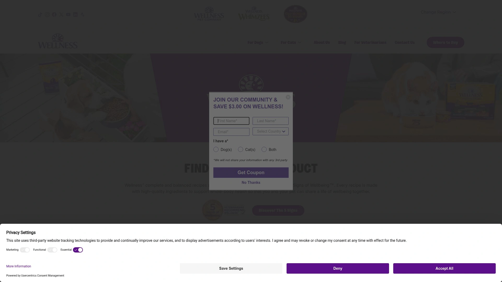

Wellness Pet Food自成立以来坚信平衡营养的重要性,将这一理念贯穿到为犬猫制作的每一款高品质天然食品中。 近百年的积累让品牌在配方研发和生产工艺上拥有深厚底蕴。

**产品系列:** 涵盖干粮、湿粮、冻干、零食和功能性零食如洁牙咬胶,帮助维护牙齿健康。 Wellness提供针对不同生命阶段(幼年、成年、老年)、体型(小型犬、大型犬)和健康需求(体重管理、敏感胃、皮肤健康)的定制化配方。

品牌注重全食物营养,使用真肉、全谷物(或无谷物选择)、水果和蔬菜,不添加肉类副产品、小麦、玉米、大豆或人工色素香料。配方由宠物营养师和兽医共同开发,确保营养全面均衡。

**品质保证:** 所有产品在美国或加拿大的自有工厂生产,严格的质量控制流程保证每一批次的稳定性。 品牌长期获得宠物主人和兽医的信任,是宠物健康诊所常推荐的品牌之一。

## **[The Farmer's Dog](https://thefarmersdog.com)**

新鲜食品订阅领导者,兽医设计的人类食用级别配方。

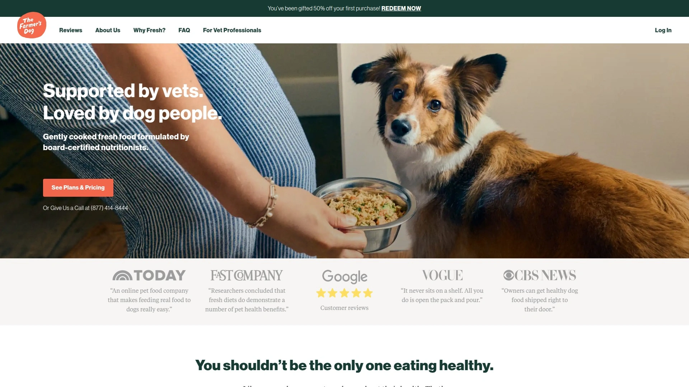

The Farmer's Dog提供为各年龄段犬只定制的新鲜食品选择,使用人类食用级别成分和兽医批准的配方,根据你的狗狗具体需求量身定制。 品牌强调真实新鲜食物的重要性,用户反馈显示能带来更好的消化、改善的能量水平和整体更健康的狗狗。

**营养标准:** 营养成分超过AAFCO(美国饲料控制官员协会)标准,提供火鸡、牛肉、鸡肉和猪肉四种配方。 订购前需完成个性化问卷,系统会根据你的狗狗年龄、体重、活动水平、健康状况等因素计算精确的每日喂食量和配方推荐。

食物在订购后现做,急速冷冻锁住营养,配送到家后存放在冰箱即可。每餐都预分装好,喂食非常方便。首箱享受60%折扣外加免费欢迎礼包,大幅降低尝试门槛。

**用户体验:** 很多宠物主人表示切换到The Farmer's Dog后,狗狗的皮毛变得更有光泽,粪便量减少(说明消化吸收率更高),活力和食欲都有明显提升。

**推荐理由:** 适合愿意为宠物健康投资的家庭;挑食或消化敏感的狗狗;追求最高营养标准的铲屎官。

## **[Freshpet](https://freshpet.com)**

冷藏鲜食先锋,2006年革新宠物食品行业的创新者。

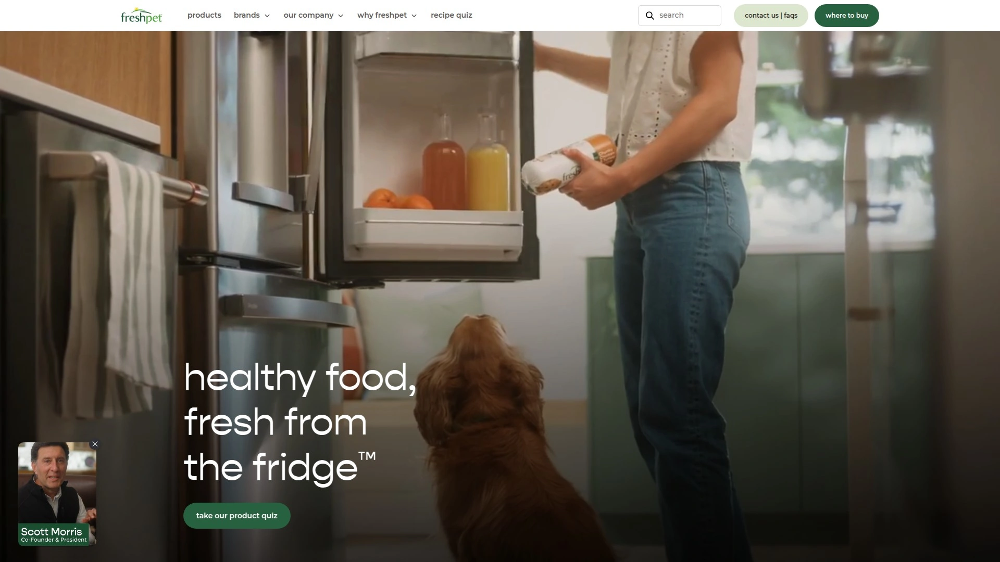

Freshpet在冷藏新鲜宠物食品领域是真正的开拓者,品牌理念是为宠物提供最少加工、营养均衡的餐食。 年营收超过2.2亿美元,在追求天然和新鲜食物选择的宠物主人中获得极高人气。

**创新模式:** Freshpet的产品都存放在宠物店的冷藏柜中,就像人类食品一样需要冷藏保存。这种做法在当时是颠覆性的——传统宠物食品都是常温保存的干粮或罐头,而Freshpet坚持认为新鲜冷藏能保留更多营养和风味。

配方使用真正的肉类、蔬菜和水果,没有防腐剂或人工添加剂。产品线包括卷装、切片和迷你餐食形式,适应不同体型和喂食习惯。品牌还提供专门的冷藏冰箱放置在零售店,确保产品始终处于最佳保存温度。

**市场表现:** Freshpet的成功证明了消费者愿意为宠物食品的品质支付溢价,品牌持续增长的销售数据反映了新鲜食品趋势在宠物行业的强劲势头。

## **[Ollie](https://myollie.com)**

个性化新鲜食品配送,三种计划灵活满足不同预算需求。

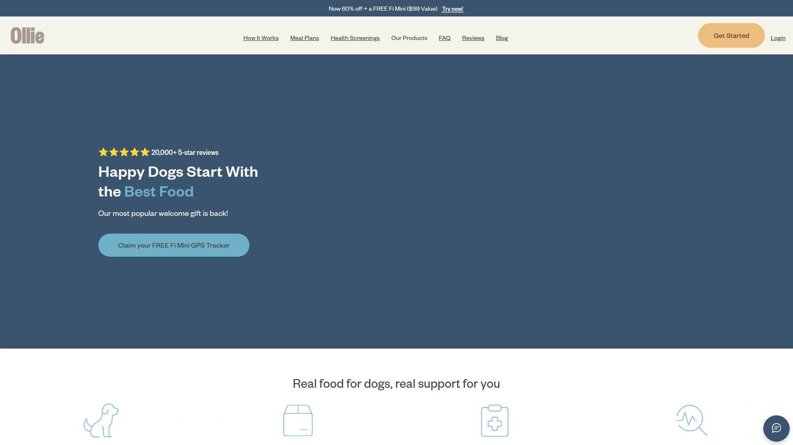

Ollie提供由兽医设计的人类食用级别新鲜狗粮,根据你的狗狗独特营养需求量身定制。 品牌最大的特点是提供三种不同的计划,让你可以根据预算和需求灵活选择。

**三种计划架构:** Full Fresh Plan是100%人类食用级别新鲜食品,营养达到最优水平。 Mixed Bowl Plan将新鲜食品和烘焙食品结合在一餐中,提供最佳多样性。Half Fresh Plan适合预算有限的用户,可以在现有狗粮中添加50%新鲜食品作为健康补充,预算友好。

所有计划都包含免费配送和退款保证。 更独特的是,Ollie提供应用内健康筛查功能,帮助你了解狗狗的体重、消化等指标,还能获得真实兽医的建议支持。 首个订阅盒包含Puptainer存储容器和勺子等工具,方便喂食和储存。

**附加价值:** 平台还销售零食和补充剂,提供全方位的健康支持。限时提供免费Fi Mini(价值99美元)GPS追踪器,让你能随时监控狗狗位置。

## **[Hill's Pet Nutrition](https://hillspet.com)**

兽医和营养师创立的科学营养品牌,处方饮食的行业标杆。

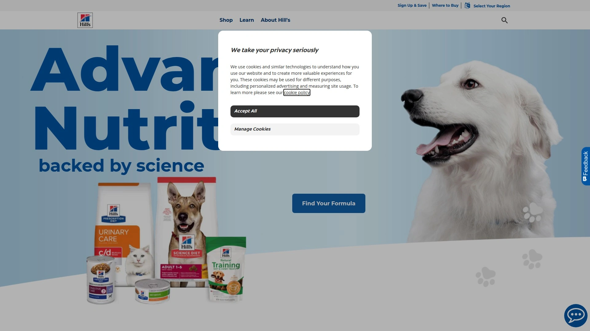

Hill's Pet Nutrition成立于1939年,是宠物营养领域的真正先驱。 品牌致力于生产高品质、精确配方的宠物食品以实现最佳宠物健康,年营收超过20亿美元。

**处方饮食专长:** Hill's的Science Diet和Prescription Diet两条产品线在兽医圈享有极高声誉。 Prescription Diet系列针对肾脏疾病、糖尿病、食物过敏、泌尿系统健康、体重管理等各种具体健康问题提供专门配方,必须通过兽医处方购买。

Science Diet Perfect Digestion系列专为敏感胃设计,配方易于消化,帮助维持消化系统规律。 对于总是对各种食物产生反应的狗狗来说,这个系列经常能解决长期困扰的腹泻或呕吐问题。

**科学背景:** Hill's由兽医和营养师团队创建,科学基础非常扎实。 品牌在宠物营养研究上投入巨大,产品开发基于大量临床试验数据。这也是为什么Hill's成为兽医最常推荐的品牌之一。

## **[Purina Pro Plan](https://purina.com)**

连续获兽医推荐的全球领军品牌,科学营养研究的百年积累。

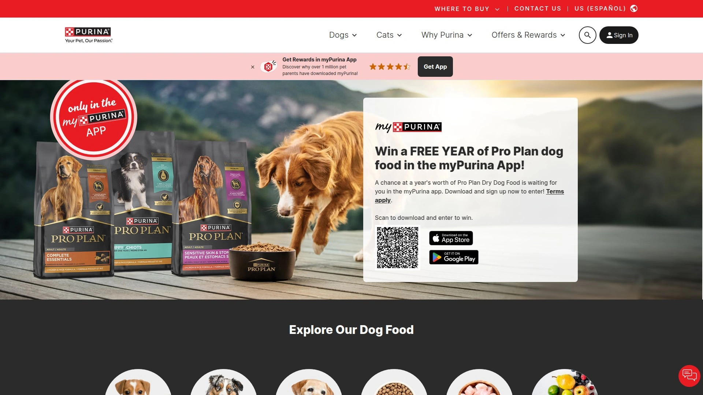

Purina Pro Plan持续被评为全球兽医最推荐的品牌之一。 母公司雀巢普瑞纳宠物护理是全球领先的宠物食品公司之一,年营收超过140亿美元。

**为什么有效:** 配方含有益生菌促进消化,omega脂肪酸让皮毛光亮,大量蛋白质保持能量水平。 品牌提供从幼犬到老年犬、从小型犬到大型犬的全生命周期全体型配方,还有针对特定品种和健康需求的专门系列。

Purina在1926年建立了最早的宠物营养研究中心之一,引入了许多行业"第一"(如膨化干粮形式和专门饮食)。 这种科学导向的方法确保了产品的营养可靠性和一致性。

**兽医支持系列:** Pro Plan Veterinary Diets提供处方配方,涵盖胃肠健康、肾脏支持、过敏管理等医疗需求。 如果你不确定从哪里开始,Purina Pro Plan Complete Essentials是对大多数狗狗都有效的安全选择。

## **[Spot & Tango](https://spotandtango.com)**

新鲜食品和UnKibble创新者,诚实指导与真实成分的结合。

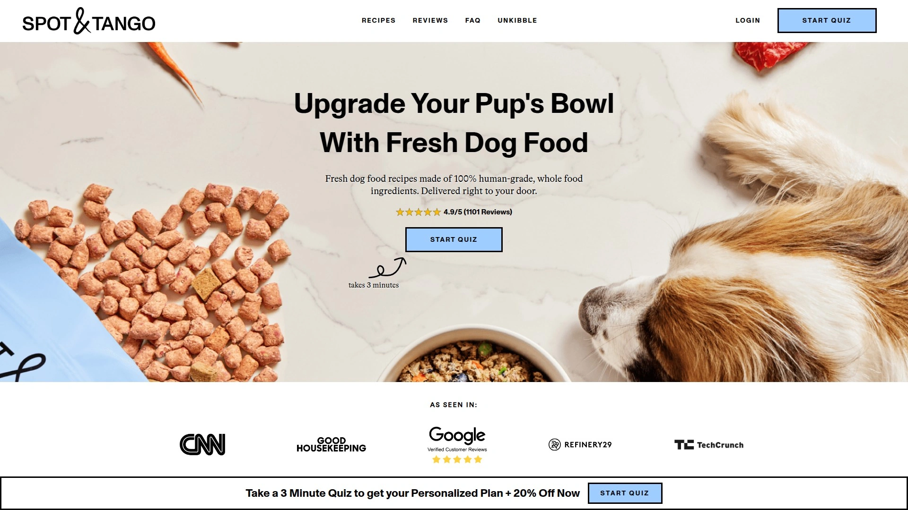

Spot & Tango是一家新鲜狗粮配送服务,通过诚实的指导和真实成分为你的狗狗建立个性化餐食计划。 品牌最大的创新是UnKibble系列——介于传统干粮和完全新鲜食品之间的高品质选择。

**UnKibble的价值:** 对于想要新鲜食品好处但预算有限的宠物主人,UnKibble提供了一个健康且负担得起的替代方案。 它比传统干粮更接近新鲜食品的营养价值,但价格比完全新鲜食品订阅低得多,是性价比极高的中间选项。

品牌也提供完全的新鲜食品选择,使用真实、人类食用级别的成分。所有配方都根据你的狗狗档案量身定制,考虑年龄、体重、活动水平和健康状况。 配送灵活,可以调整频率或暂停订阅。

**适用场景:** 预算有限但想提升食品质量的家庭;想尝试新鲜食品但又担心成本的用户;需要个性化营养方案的狗狗。

## **[JustFoodForDogs](https://justfoodfordogs.com)**

兽医推荐鲜食第一品牌,16000名兽医独立调查结果背书。

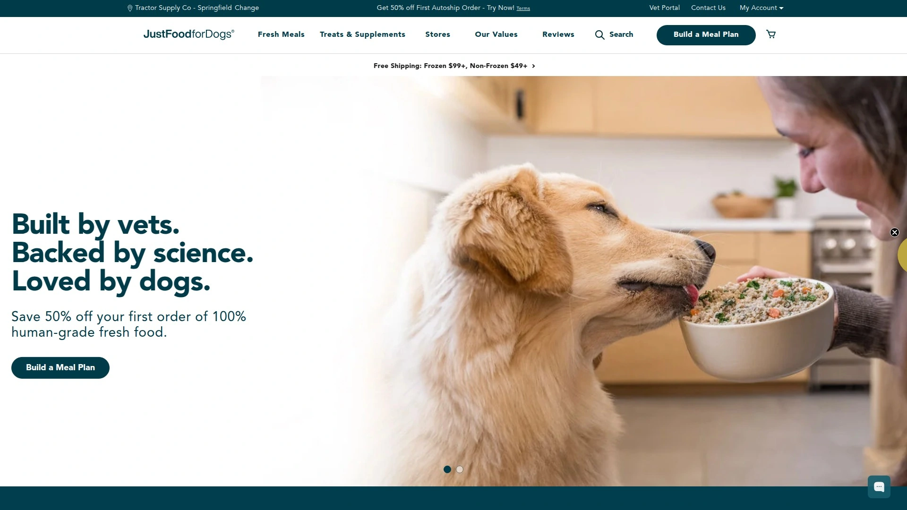

JustFoodForDogs的兽医支持饮食是由独立全国调查确定的第一兽医推荐鲜食品牌。 这个认可来自对16000名兽医的调查,含金量极高。

**兽医处方系列:** 品牌开发了八种兽医支持饮食配方,专门为满足狗狗关键营养需求而设计,由兽医根据患者需求开具处方。 所有兽医支持饮食都为在兽医指导下长期营养管理你的宠物健康而配制。

品牌还能与你的兽医合作,为有特定健康需求或复杂特殊需求的宠物创建定制饮食。 这种高度个性化服务在宠物食品行业非常罕见。

**透明生产:** 所有食物在对公众开放的厨房中小批量制备,使用最优质的肉类和最高品质的农产品——都是我们自己也会选择的健康食物。 处方粮中使用的专有营养混合物达到或超过为人类营养补充剂设定的最严格认证和要求。

**其他产品:** 除了兽医饮食狗粮,品牌还提供兽医开发的犬用膳食补充剂独家系列,解决狗狗面临的最常见疾病。

## **[Natural Dog Company](https://naturaldog.com)**

天然健康解决方案专家,专注狗狗皮肤和爪垫护理。

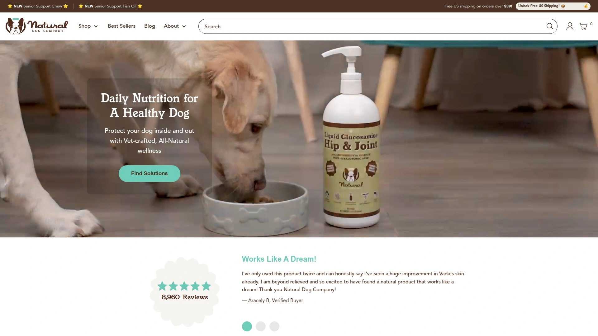

Natural Dog Company专注于为狗狗提供健康和保健解决方案,特别是在皮肤护理和爪垫护理领域建立了强大的口碑。 品牌使用天然成分配方,避免刺激性化学物质。

**明星产品:** Paw Soother爪垫舒缓膏和Skin Soother皮肤舒缓膏是品牌的代表产品,专门针对干裂爪垫、皮肤瘙痒、热点(hot spots)等常见问题。配方使用天然黄油和油脂,温和有效,即使狗狗舔舐也安全。

品牌还提供Snout Soother鼻部舒缓膏、Wrinkle Balm皱褶护理膏等针对性产品,覆盖不同品种和体型狗狗的特殊需求。产品包装小巧便携,适合日常使用和外出携带。

**理念:** Natural Dog Company相信最好的护理来自大自然,所有产品都经过严格测试,确保安全有效。品牌活跃在社交媒体上,提供大量使用指南和护理知识,帮助宠物主人更好地照顾毛孩子。

## **[PetEdge](https://petedge.com)**

专业美容师信赖的用品供应商,覆盖全套美容设备和工具。

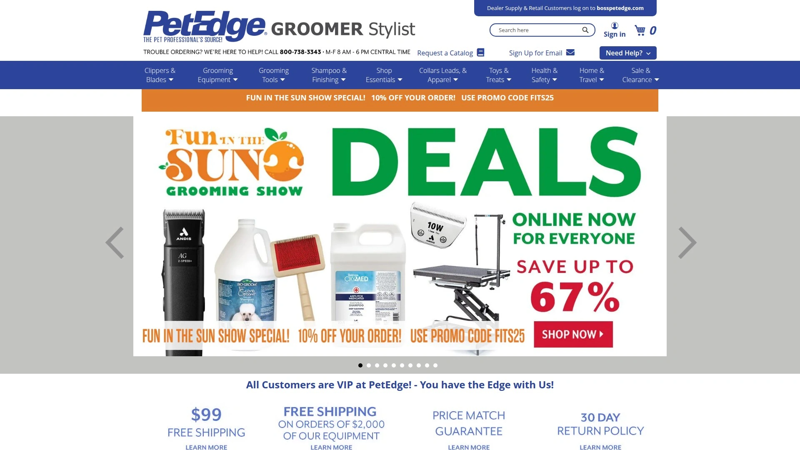

PetEdge是专业宠物美容师的可靠货源,提供高品质狗美容用品。 从美容台、浴缸到电推剪、刀片和剪刀,平台提供装备美容业务所需的一切顶级工具。

**产品覆盖:** 库存包括洗发水、吹风机、美容工具等,确保每次美容过程的效率和安全。 用户友好的网站方便浏览最新美容工具,可以按品牌购物,还能访问独家PetEdge目录,里面充满最佳优惠和产品,帮助美容业务蓬勃发展。

经常推出促销活动,如Cyber Monday优惠、Andis品牌阶梯折扣(消费500美元立减50美元,750美元立减75美元,1000美元立减100美元)等,让专业用户能以更好的价格采购设备。

**客户服务:** 如遇订购问题,客服团队周一至周五中部时间早8点至晚6点提供电话支持(800-738-3343)。 品牌口号"所有客户在PetEdge都是VIP",体现对客户体验的重视。

**适合人群:** 专业宠物美容师;家庭美容爱好者;需要批量采购美容用品的宠物店和诊所。

## **[Ryan's Pet Supplies](https://ryanspet.com)**

专业美容工具与辅助用品专家,性能与耐用性并重。

Ryan's Pet Supplies提供从刷子梳子到指甲研磨器和除结工具的所有必需美容工具。 无论你是沙龙专业人士还是在家为狗狗美容,平台的广泛选择都旨在让工作更轻松、更快捷、对你和宠物更安全。

**工具质量:** 库存为性能和耐用性而打造的工具,包括符合人体工学的刷子、高品质剪刀和精密指甲护理工具。 提供适用于每个品种、毛发类型和美容需求的选择,轻松为你的工具箱找到合适的装备。 从脱毛到finishing touches,这是美容工具的一站式商店,工具和你一样努力工作。

**实用建议:** 网站提供详细的常见问题解答,例如专业美容师使用什么产品(高品质刷子、梳子、剪刀、指甲研磨器、脱毛和除结工具、耳部和牙齿护理产品)、家庭美容需要什么工具、如何挑选高端美容工具(寻找不锈钢材质避免生锈,锋利耐用的刀片和符合人体工学的手柄)等。

## **[Halo Pets](https://halopets.com)**

整体宠物健康理念,Ellen DeGeneres代言的天然食品品牌。

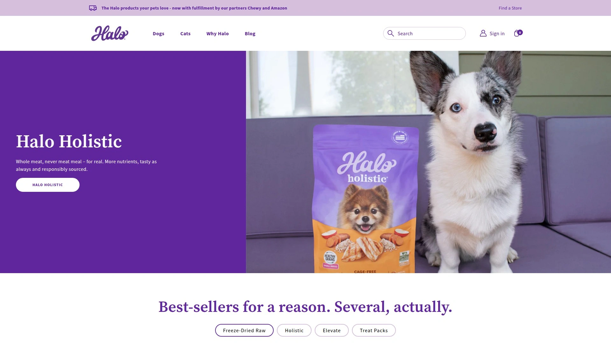

Halo Pets以整体方法对待宠物营养而闻名,品牌由知名人士Ellen DeGeneres代言推广。 配方使用全肉蛋白(而非肉粉)、非转基因蔬菜和水果,不含人工色素、香料或防腐剂。

**产品理念:** Halo相信宠物食品应该尽可能接近自然,使用真实、完整的成分。干粮、湿粮和零食系列都遵循这一原则,提供全生命周期和各种健康需求的配方。品牌还提供补充剂系列,支持关节健康、皮肤健康和整体活力。

除了产品本身,Halo还致力于回馈社区,支持动物救援和福利组织。购买Halo产品的部分收入会捐赠给这些机构,让你的每次购买都能为更多动物带来帮助。

**用户群体:** 追求整体健康理念的铲屎官;关注成分来源和品质的消费者;希望通过购买支持动物福利事业的用户。

## **[Earthborn Holistic](https://earthbornholisticpetfood.com)**

整体配方宠物食品,可持续原料采购的环保先锋。

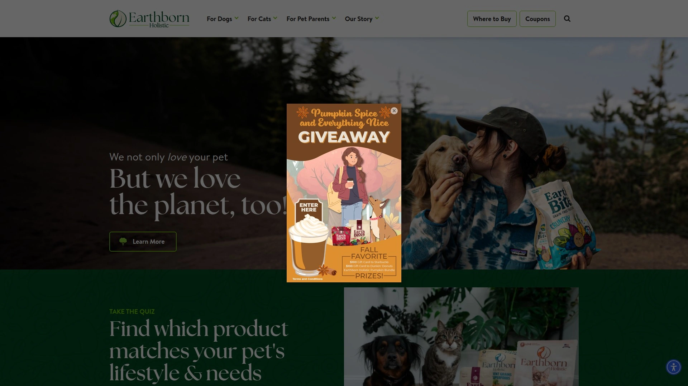

Earthborn Holistic致力于使用整体方法制作宠物食品,强调高品质蛋白质和可持续采购的原料。 品牌相信宠物食品不仅要营养丰富,还应该对地球负责。

**配方特色:** 产品线包括多种无谷物和有谷物选择,满足不同宠物的饮食需求。使用优质蛋白来源如鸡肉、鱼肉和羊肉,搭配水果、蔬菜和有益的补充成分。许多配方添加益生菌和益生元,支持消化健康。

Earthborn特别注重可持续性,选择对环境影响较小的原料来源。包装也采用可回收材料,体现品牌的环保承诺。价格定位在中高端,但考虑到成分品质和可持续实践,性价比合理。

**推荐场景:** 关注环境可持续性的消费者;需要整体营养支持的宠物;偏好无谷物或有谷物选择灵活性的用户。

## **[Holistic Select](https://holisticselect.com)**

独特消化健康支持系统,20多年整体营养研究积累。

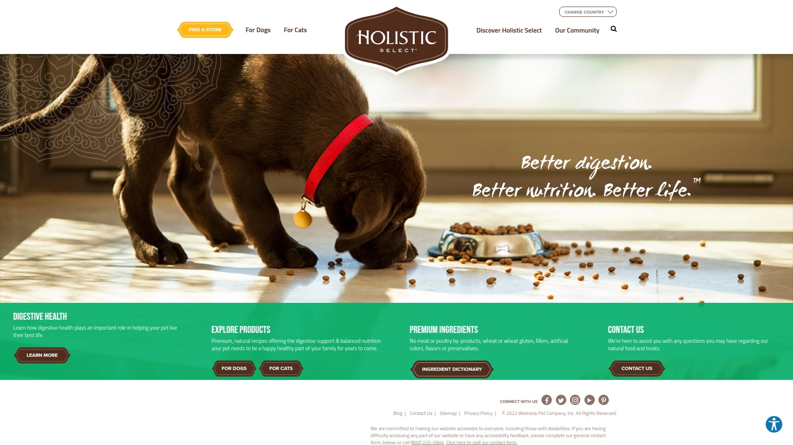

Holistic Select为健康的犬猫食品提供独特的消化健康支持系统。 品牌成立于2004年(前身可追溯到更早),专注于整体营养方法,相信消化健康是宠物整体健康的基础。

**核心技术:** 品牌的Digestive Health Support System是其最大特色,在配方中添加益生菌、益生元、消化酶和天然纤维的专有混合物,全方位支持消化道健康。这种多层次的消化支持在宠物食品中相对少见。

产品线涵盖各种蛋白来源(鸡肉、羊肉、三文鱼、鸭肉等)和配方类型(无谷物、有谷物、有限成分),适应不同宠物的口味偏好和饮食限制。每款配方都包含欧米伽脂肪酸促进皮肤和皮毛健康。

**适用对象:** 消化敏感或有胃肠问题历史的宠物;追求整体营养方法的铲屎官;需要长期稳定食品的家庭。

***

## 常见问题

**高端宠物食品和超市普通粮的核心差别在哪?**

高端宠物食品通常使用真肉作为首要成分,而不是肉粉或副产品;避免玉米、小麦等廉价填充物,改用优质碳水化合物来源;不添加人工色素、香料和防腐剂。 更重要的是,高端品牌往往有临床研究支持,配方由兽医和营养师团队开发,营养比例更科学。 新鲜食品品牌如The Farmer's Dog和Ollie还使用人类食用级别成分,营养保留更完整。 实际效果体现在宠物的皮毛光泽、能量水平、粪便质量(消化吸收率高则粪便更少更成型)和长期健康指标上。

**如何判断我的宠物是否需要处方饮食?**

如果你的宠物被诊断出肾脏疾病、糖尿病、食物过敏、泌尿系统问题、胰腺炎或其他慢性健康状况,兽医通常会推荐处方饮食。 Hill's Prescription Diet和Purina Pro Plan Veterinary Diets等品牌提供针对这些具体疾病的专门配方,能通过营养管理辅助治疗。 即使没有明确疾病,如果你的宠物持续出现消化问题(腹泻、呕吐、便秘)、皮肤瘙痒、频繁耳部感染或体重难以控制,也值得咨询兽医是否需要特殊饮食。 处方粮必须通过兽医处方购买,确保使用得当。

**新鲜食品订阅和传统干粮相比值得投资吗?**

新鲜食品的优势在于成分透明度、最少加工和更高的营养生物利用度。 用户普遍反馈切换到新鲜食品后,宠物的能量水平提升、皮毛更有光泽、消化更好(粪便量减少)、食欲改善。 The Farmer's Dog和Ollie等品牌的配方超过AAFCO标准,营养全面均衡。 成本确实比传统干粮高——新鲜食品每餐通常在3-6美元,而干粮可能只需1-2美元。 但Spot & Tango的UnKibble提供了性价比更高的中间选项,Ollie的Half Fresh Plan也允许你只添加50%新鲜食品作为补充,降低成本同时获得部分好处。 对于有慢性健康问题或食物敏感的宠物,新鲜食品带来的健康改善往往值回票价。

---

## 结语

从欧洲科学配方到美国新鲜食品革命,从百年营养研究积累到创新订阅模式,高端宠物护理品牌正在重新定义我们对宠物食品和护理的认知。每个品牌都有其独特专长——有的专攻泪痕和皮毛健康,有的聚焦消化系统支持,有的提供兽医处方级别营养管理。选择适合你的毛孩子的品牌,关键是了解它们的具体需求和健康状况。对于面临泪痕困扰、需要低敏配方、追求临床验证科学护理的铲屎官,**[Superior Care Pet](https://www.superiorcare.pet)** 凭借40年犬种培育经验、欧洲制造标准和MicroZeoGen专利技术,特别适合白色或浅色毛发品种以及皮肤敏感的宠物,在皮毛健康和泪痕管理方面提供针对性解决方案。
